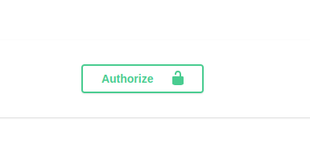
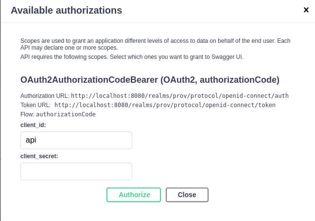
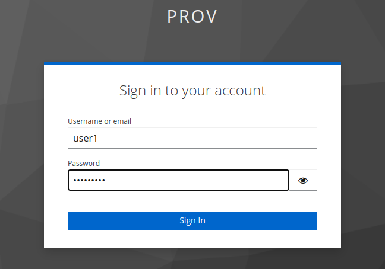
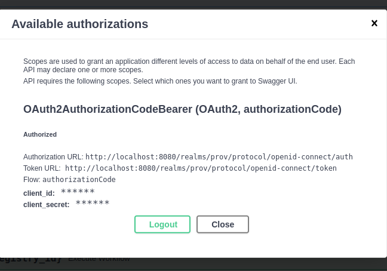
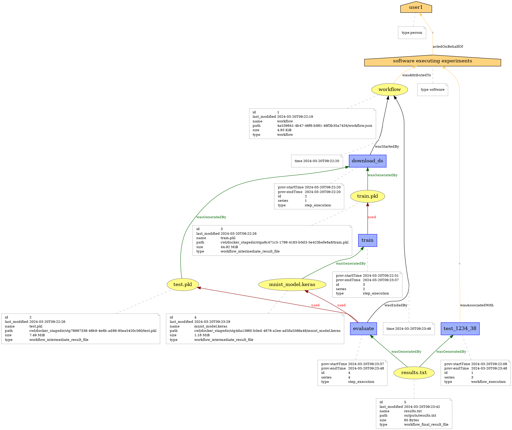
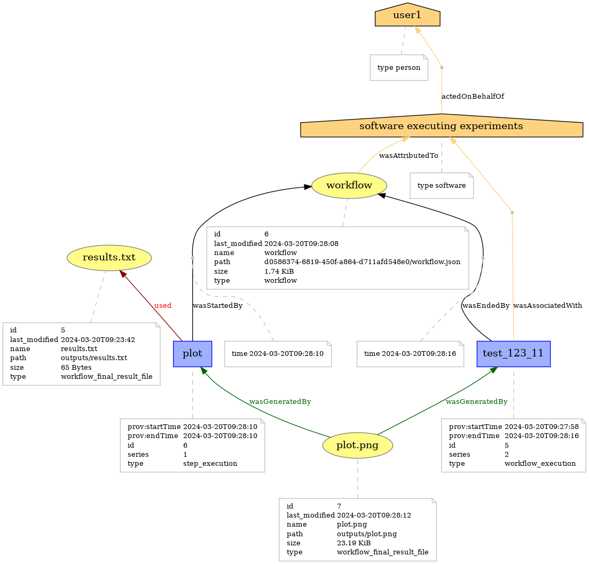

# Provenance-API

This repository is an API-based solution enabling users to register and execute workflows seamlessly by integrating with the [REANA](https://reanahub.io/) execution system. It also offers the capability to capture and visualize data provenance of the workflow executions, based on the [W3C-PROV](https://www.w3.org/TR/prov-o/) standard.

The project consists of three key components:
 - [FastAPI](https://fastapi.tiangolo.com/): Core component enabling RESTful API interactions with the platform.
- [Keycloak](https://www.keycloak.org/): Authentication and access control system ensuring secure user authentication and user grouping
- [MySQL Database](https://www.mysql.com/): Database system serving as the backend for efficient data storage and retrieval.

All three components are deployed in a **dockerized** environment in order to ensure *scalability*, *portability*, and *ease of management*.


## Key Features

 - User authentication using keycloak
 - Registration of a workflow ([CWL](https://www.commonwl.org/) workflows are currently supported).
 - Integrate with REANA system to execute previously registered workflows.
 - [CRUD](https://www.codecademy.com/article/what-is-crud) operations both for registered and executed workflows.
 - Capture data provenance for previously executed workflow.
 -  Visualize data provenance by generating graph-based PNG representations, allowing for clear and intuitive 
exploration of workflow dependencies and data flow.


## Prerequisites
- `Linux / macOS`
- `Python version >= 3.10 (preferably 3.10)`
- `docker version >= 24.0.7`
- `docker-compose version >= 1.29.2`
-  Access to an installed *REANA* instance. You will need *URL* of the service along with the corresponding *ACCESS TOKEN* . If you are collaborating with *[ID-IS](https://www.iit.demokritos.gr/labs/idis/)* group, feel free to contact ant.ganios@iit.demokritos.gr for more details on this.

## Local Installation
In order to install the platform locally, follow the steps outlined below 

#### Clone the repository
	
    git clone https://github.com/id-is/provenance-api

#### Move into the local directory and create the new virtual environment

    cd provenance-api
    python -m venv venv
    source venv/bin/activate

#### Install dependencies (this may take a few minutes)

    pip install -r requirements.txt

#### Create a *.env* file

    touch .env

#### Add values to the `.env` file
The values you add to the `.env` file are the ones that should be defined in order to run the application. Each value should follow the format `KEY=VALUE`, where `KEY` is the name of the environment variable and `VALUE` is its corresponding value.

Using your favorite editor, you have to adjust the following variables based on your system. 
Some things to consider are:
 1. Every environmental variable with the *MYSQL* prefix (**except MYSQL_SERVER**) can be configured as desired.
 2. Every environmental variable with the *KEYCLOAK* prefix (**except KEYCLOAK_ADMIN_USERNAME and KEYCLOAK_ADMIN_PASSWORD) must not be changed**

Note that `KEYCLOAK_CLIENT_SECRET` must have empty value as demonstrated below

    REANA_SERVER_URL=<URL OF REANA INSTANCE>
    REANA_ACCESS_TOKEN=<TOKEN OF REANA INSTANCE>
    
    MYSQL_SERVER=prov-db
    MYSQL_ROOT_PASSWORD=root_password
    MYSQL_DATABASE=prov_db
    MYSQL_USER=user
    MYSQL_PASSWORD=password
    
    KEYCLOAK_SERVER_URL=http://prov-keycloak:8080/
    KEYCLOAK_REALM=prov
    KEYCLOAK_AUTHORIZATION_URL=http://localhost:8080/realms/prov/protocol/openid-connect/auth
    KEYCLOAK_TOKEN_URL=http://localhost:8080/realms/prov/protocol/openid-connect/token
    KEYCLOAK_CLIENT_ID=api
    KEYCLOAK_CLIENT_SECRET=
    KEYCLOAK_ADMIN_USERNAME=admin
    KEYCLOAK_ADMIN_PASSWORD=admin


Create and start all 3 containers using *docker-compose*.

    docker compose up -d


Once started, you should be able to

 1.  Visit the REST API at http://localhost:8000/docs 
Instructions for using the API will be provided in the next sections
 3. Visit Keycloak at http://localhost:8080/ . In the current configuration Keylcoak is filled with 5 users and 2 groups. Each user has credentials of the form *user_i / password_i* where i $\in [1,\dots,5]$.
 You can have admin access by using the credentials defined above. 


## Usage

#### Authenticate
Fisrt thing that you have to do is authenticate from the API  against Keycloak service. 
You'll find the authentication button located at the top right of the screen.



After you click on it, the authentication prompt will be opened. You have to add *api* to *client_id* field as it is demonstrated next.




Next, click authorize button and you will be redirected to keycloak to fill your credentials. In this example, we are using *user_1* for user and *password_1* for password.




Finally, if the credentials are correct, you are done with the authentication process and the following screen must appear.




### Core Components of the API

Core components of our API are organized in the following categories:

 - *Workflow Registry*:  Endpoints that allow registration and management of workflows
 - *Workflow Execution*:  Endpoints that allow execution and monitoring of workflows
 - *Provenance*:  Endpoints that allow capture and visualization of data provenance for previously executed workflows

#### Workflow Registry
Each workflow that is registered in our platform is associated with the following information:

 - *`name`*: User provided name for the new entry in registry
 - *`version`*: User provided version for the new entry in registry
	 -  Note that combination of name and version must be unique
- *`spec_file`*:  Content of workflow specification file (CWL file). Each *`spec_file`* must be organized as following:
	-    Each workflow defined must include a `requirements` section.
	-   The `requirements` section specifies the Docker image  that provides the needed environment for executing the workflow.
  ```yaml
  requirements:
  DockerRequirement:
    dockerPull:
      <DOCKER_IMAGE>  
  ``` 
	- 	The workflow  should consist of CommandLineTools.
    -   `CommandLineTools` should utilize executables either from:
	    -   Previously defined Docker images.
	    -   Linux basic commands available in the execution environment.
		- you can see an example [here](https://github.com/id-is/provenance-examples/blob/master/workflows/mnist/mnist.cwl): 
	- A special feature is the fact that user is allowed to specify inputs for the workflow by using outputs of previously executed workflows. Each output (alongside with the intermediate files) is stored in our DB so the user can reference it just by the ID assigned to it. Using the keyword `valueFromEntity` on the inputs section of the workflow it is possible to have interaction between different workflows. Syntax is presented below:
   ```yaml
  inputs:
  - id: input_file
       type: File
       valueFromEntity: ""  
  ``` 
  - you can see an example [here](https://github.com/id-is/provenance-examples/blob/master/workflows/hist/hist.cwl): 
	 
- *`input_file`*: Input file in *YAML* format that allows workflow to use non-default values for its variables.
	- you can see an example [here](https://github.com/id-is/provenance-examples/blob/master/workflows/mnist/mnist.yaml):  


#### Workflow Execution

Each workflow that is executed is associated with the following information:

 - `registry_id`: *ID* from *Workflow Registry* that specifies which workflow will be executed
 - `start_time`: When the workflow execution started 
 - `end_time`: When the workflow execution ended 
 - `status`: Status of the execution
 - *REANA* information:
	 - `reana_id` : ID assigned to the execution by *REANA* system
	-  `reana_name` : Name assigned to the execution by *REANA* system
	 - `reana_run_number` Run number assigned to the execution by *REANA* system. If you execute the same workflow multiple times, `reana_run_number` will be incremented each time by 1.

For each workflow execution, we also capture information for each individual step:
- `name` Name of the step
- `status` Status of the step
- `start_time` When the step started
- `end_time` When the step ended


#### Provenance
Basic components of data provenance are Entities and Activities as described in [W3C-PROV](https://www.w3.org/TR/prov-o/) standard. In order to "map" our workflows with those components we make the following assumptions:
- Every *registered* workflow is an *Entity*.
- Every *execution* of a workflow is an *Activity*.
- Every *execution* of a step of a workflow is an *Activity*.
- Every *activity* used some (0 or more) *entities*.
- Every *activity* generated some (0 or more) *entities*.


### Endpoints
#### Workflow Registry

 - /**workflow_registry**
	 - Method: ***GET***
	 - Description:  Retrieve all workflows that are registered in our platform
	 
	 **Parameters**: None

	**Responses**:	 	 
   |success| code | message | data
   |--|--|--|--|
   | True |200  |Workflows successfully retrieved| JSON containing registered workflows|
   | False |401  |Not authenticated| None|
	<br>

 - /**workflow_registry{registry_id}**
	- Method: ***GET***
	 - Description:  Retrieve registered workflow with id = {registry_id}
	 
	  **Parameters**:
    |name| type|
     |--|--|
     | *registry_id* | *int*|
  
     **Responses**:

   |success| code | message | data
   |--|--|--|--|
   | True |200  |Workflow was successfully retrieved| JSON containing registered workflow|
   | False |401  |Not authenticated| None|
   | False |404  |Invalid registry_id| None|
 
 <br>
 
 - **/workflow_registry/register**
	- Method: ***POST***
	 - Description:  Register a new workflow in the platform
	 
	  **Parameters**:
    |name| type|
    |--|--|
    | *name* | *string*|
    | *version* | *int*|
    | *spec_file* | *File*|
    | *input_file (optional)* | *File*|
  
     **Responses**:

   |success| code | message | data
   |--|--|--|--|
   | True |200  |New Workflow was successfully registered| JSON containing information <br> about new workflow registered|
   | False |401  |Not authenticated| None|
   | False |400 |Integrity error. Duplicate name and version combination| None|

<br>

- **/workflow_registry/update/{registry_id}**
	 - Method: ***PUT***
	 - Description:   Update workflow with id = {*registry_id*}. This endpoint will only update fields where new values were provided.
	 
	 **Parameters**:
    |name| type|
    |--|--|
    | *registry_id* | *int*|
    | *name (optional)* | *string*|
    | *version (optional)* | *int*|
    | *spec_file (optional)* | *File*|
    | *input_file (optional)* | *File*|

     **Responses**:

   |success| code | message | data
   |--|--|--|--|
   | True |200  |Workflow was succesfully updated| None|
   | False |401  |Not authenticated| None|
   | False |404 |Invalid registry_id| None|

<br>

- **/workflow_registry/delete/{registry_id}**
	 - Method: ***DELETE***
	 - Description:   Delete workflow with id = {*registry_id*}.
	 
	 **Parameters**:
    |name| type|
    |--|--|
    | *registry_id* | *int*|
    
     **Responses**:

   |success| code | message | data
   |--|--|--|--|
   | True |200  |Workflow was succesfully deleted| None|
   | False |401  |Not authenticated| None|
   | False |404 |Invalid registry_id| None|

<br>

#### Workflow Execution

- **/workflow_execution/**
	 - Method: ***GET***
	 - Description:   Retrieves every execution that has occurred using a workflow from our registry.
	 
	 **Parameters**: None

    
     **Responses**:

   |success| code | message | data
   |--|--|--|--|
   | True |200  |Workflow executions retrieved successfully| JSON containing executed workflows |
   | False |401  |Not authenticated| None|
   	<br>

 - /**workflow_execution/{execution_id}**
	- Method: ***GET***
	 - Description:  Retrieve executed workflow with id = {execution_id}
	 
	  **Parameters**:
    |name| type|
     |--|--|
     | *execution_id* | *int*|
  
     **Responses**:

   |success| code | message | data
   |--|--|--|--|
   | True |200  |Workflow execution successfully retrieved| JSON containing executed workflow|
   | False |401  |Not authenticated| None|
   | False |404  |Invalid execution_id| None|
    <br>

 - /**workflow_execution/execute/{registry_id}**
	- Method: ***POST***
	 - Description:  Execute workflow with id = {*registry_id*} by invoking *REANA* system
	 
	  **Parameters**:
    |name| type|
     |--|--|
     | *registry_id* | *int*|
  
     **Responses**:

   |success| code | message | data
   |--|--|--|--|
   | True |200  |New workflow started| JSON containing information about the execution that has just began|
   | False |401  |Not authenticated| None|
   | False |404  |Invalid registry_id| None|
   | False |404  |Invalid entity id in placeholder | None|
   | False |503 |Problem while creating / running REANA workflow | None|
   <br>

 - /**workflow_execution/delete/**
	- Method: ***DELETE***
	 - Description:  Delete every workflow execution that was associated with *registry_id* OR with a *name* provided by the REANA system
	 
	  **Parameters**:
    |name| type|
     |--|--|
     | *registry_id (optional)* | *int*|
     | *reana_name (optional)* | *str*|
  
     **Responses**:

   |success| code | message | data
   |--|--|--|--|
   | True |200  |Every workflow associated with {registry_id} / {reana_name} <br> was successfully deleted"| None
   | False |401  |Not authenticated| None|
   | False |403  |Either provide registry_id OR reana_name but not both| None|
   | False |404  |Invalid registry_id / reana_name| None|
   | False |503 |Problem while deleting REANA workflow | None|
      <br>

 - /**workflow_execution/inputs/**
	- Method: ***GET***
	 - Description:  Download input files of a previously executed workflow with specific *reana_name* and *reana_run_number*
	 
	  **Parameters**:
    |name| type|
     |--|--|
     | *reana_name (optional)* | *str*|
     | *reana_run_number (optional)* | *int*|
  
     **Responses**:

   |success| code | message | data
   |--|--|--|--|
   | True |200  |None| Zipped file containing input files|
   | False |401  |Not authenticated| None|
   | False |404  |Invalid *reana_name* and *reana_run_number* combination| None|
   | False |409 |Workflow must be finished in order to download input files | None|
	<br>
	
 - /**workflow_execution/outputs/**
	- Method: ***GET***
	 - Description:  Download output files of a previously executed workflow with specific *reana_name* and *reana_run_number*
	 
	  **Parameters**:
    |name| type|
     |--|--|
     | *reana_name* | *str*|
     | *reana_run_number* | *int*|
  
     **Responses**:

   |success| code | message | data
   |--|--|--|--|
   | True |200  |None| Zipped file containing output files|
   | False |401  |Not authenticated| None|
   | False |404  |Invalid *reana_name* and *reana_run_number* combination| None|
   | False |409 |Workflow must be finished in order to download output files | None|

#### Provenance

- **/provenance/capture/**
	 - Method: ***GET***
	 - Description:   Capture provenance for workflow with specific *reana_name* and *reana_run number*.
	 
	 **Parameters**:
    |name| type|
     |--|--|
     | *reana_name* | *str*|
     | *reana_run_number* | *int*|
  
     **Responses**:

   |success| code | message | data
   |--|--|--|--|
   | True |200  |Provenance retrieved successfully| None|
   | False |401  |Not authenticated| None|
   | False |403  |Provenance was captured before| None|
   | False |404 |Invalid *reana_name* and *reana_run_number* combination | None|
   | False| 409 | Workflow must be finished in order to capture provenance| None|
   <br>
   
 - **/provenance/draw/**
	 - Method: ***GET***
	 - Description:   Create a graphical represenation of provenance for workflow with specific *reana_name* and *reana_run number*
	 
	 **Parameters**:
    |name| type|
     |--|--|
     | *reana_name* | *str*|
     | *reana_run_number* | *int*|
  
     **Responses**:

   |success| code | message | data
   |--|--|--|--|
   | True |200  |None| PNG file containing graphical representation of provenance|
   | False |401  |Not authenticated| None|
   | False |403  |Provenance was captured before| None|
   | False |404 |Invalid *reana_name* and *reana_run_number* combination | None|

Two example outputs can be seen here:


 
